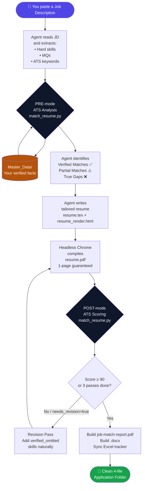
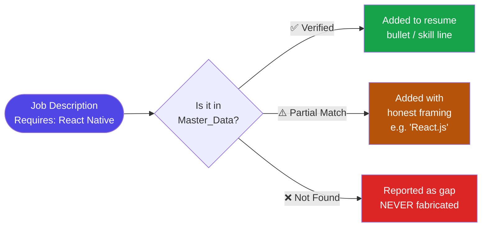
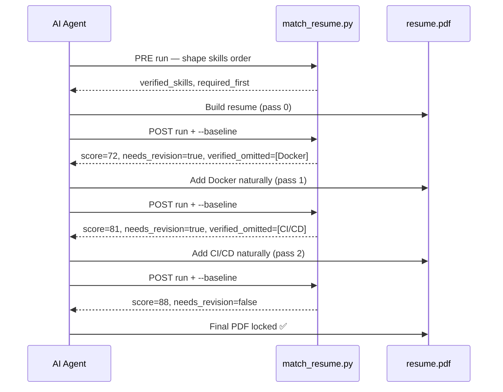

# Agentic Resume Engine

An AI-agent-powered automated resume production pipeline that transforms job descriptions into **truthful**, **ATS-optimized**, **1-page PDF resumes** and **match report PDFs** using Headless Chrome.

> **Zero-Fabrication Policy**: This engine enforces a strict truth boundary. It tailors resumes strictly using verified facts from your personal `Master_Data/` files and will **never** invent skills or experience to artificially inflate match scores.

---

## How It Works



---

## Truth Engine: What Gets Into Your Resume



---

## ATS Scoring Loop



---

## Output: 4-File Application Folder

Every completed job application produces **exactly 4 files** and nothing else. All intermediate build artifacts are automatically deleted.

```
Stripe - Backend Software Engineer/
├── prompt.md              ← Your original job prompt (preserved, never modified)
├── job-description.md     ← Clean copy of the full JD
├── resume.pdf             ← 1-page tailored ATS resume
└── job-match-report.pdf   ← Scoring breakdown, keyword analysis, gaps
```

---

## Instant Setup via AI Agent Prompt

If you are using an AI-enabled IDE or Agent (such as **Antigravity**, **Cursor**, **Windsurf**, or **VS Code with AI Agent**), simply open your AI chat and paste this prompt:

> **Copy & Paste Prompt into your AI Agent:**
> ```text
> Clone the Agentic Resume Engine repository from
> https://github.com/CoderShubhamMate/agentic-resume-engine.git,
> set up the Python environment (.venv) using tools/requirements.txt,
> and guide me on updating the Master_Data/ files with my verified
> background information so I can generate tailored 1-page ATS resumes!
> ```

The AI agent will automatically clone the repository, install Python dependencies, and walk you through populating your verified candidate facts!

---

## Key Features

- **Automated Job Description Analysis** — Extracts hard skill requirements, soft skills, and Minimum Qualifications (MQs).
- **Truth Engine Verification** — Validates every skill against your `Master_Data/` repository before adding it to the resume.
- **1-Page Visual Guarantee** — Renders HTML/CSS via Headless Chrome (`--print-to-pdf`) to ensure crisp formatting and strict 1-page compliance.
- **ATS Match & Scoring Engine** — Computes objective keyword match scores (0–100%) and exports a detailed `job-match-report.pdf`.
- **Revision Loop** — Up to 3 automated passes to improve score by naturally adding verified skills — never by fabricating.
- **Clean 4-File Application Isolation** — Every application receives a dedicated folder containing only 4 clean files (see above).

---

## System Requirements

- **Python 3.10+**
- **Google Chrome** (for headless PDF generation)
- **AI Coding Assistant** with agent/rules support — e.g. [Antigravity](https://antigravity.dev), [Cursor](https://cursor.com), [Windsurf](https://windsurf.com), or VS Code with an AI agent extension

---

## Manual Quick Start Guide

### 1. Clone the Repository
```bash
git clone https://github.com/CoderShubhamMate/agentic-resume-engine.git
cd agentic-resume-engine
```

### 2. Set Up Python Environment
```bash
python -m venv .venv

# On Windows PowerShell:
.\.venv\Scripts\activate

# On macOS/Linux:
source .venv/bin/activate

pip install -r tools/requirements.txt
```

### 3. Populate `Master_Data/` — Your Source of Truth

> **See [`examples/Master_Data/`](examples/Master_Data/) for fully worked examples of every file.**

Replace the placeholder files with **your verified background**. The agent will only use facts from these files — it will never invent anything not present here.

| File | What to put in it |
|------|-------------------|
| `All_Info.md` | Contact details, work experience with real bullets, all projects, education, certifications |
| `Timeline.md` | Master chronology for degrees, jobs, projects, and certifications (prevents date collisions) |
| `Projects.md` | Project titles (exact, locked), tech stacks (exact, locked), and verified bullet descriptions |
| `Education_and_Skills.md` | Degrees, institutions, verified technical skills by category |
| `Background.md` | Target roles and core focus areas |

### 4. Update the Agent Rule Files

The engine is governed by a modular 10-rule suite in `.agents/rules/` (`00` through `09`):
- Edit `.agents/rules/01-truthfulness.md` **Section 1.2** with your fixed candidate identity:
  - Replace `[Candidate Full Name]`, `[email@example.com]`, `[Phone Number]`, school names, employers, and dates with your verified facts.
- Edit `.agents/rules/02-project-naming-and-stacks.md` **Section 2.2** with your locked projects and stacks.
- `Master_Data/` (Step 3) is the **content source of truth** — it drives every bullet, skill, and project on the resume.
- Rule files enforce strict behavioral boundaries: zero hallucination, locked project names/stacks, clean 1-page left-rail layouts, and no target company names in resume summaries.

---

## Generating a Tailored Resume via AI Agent

> **See [`examples/job_prompt_example.md`](examples/job_prompt_example.md) for a fully filled example.**

Whenever you want to apply for a new job, paste this prompt into your AI Agent:

> **Copy & Paste Prompt for any Job Application:**
> ```text
> I want to generate a tailored resume application package.
>
> Company: [Company Name]
> Role: [Job Title]
> Location: [Location]
>
> Job Description:
> [Paste full raw job description here]
>
> Please process the full resume generation pipeline for this job.
> ```

The AI Agent will automatically:
1. Parse the JD and run PRE-mode keyword analysis.
2. Tailor your resume strictly using verified facts from `Master_Data/`.
3. Compile a 1-page `resume.pdf` via Headless Chrome.
4. Run POST-mode ATS scoring and revision passes (up to 3).
5. Produce `job-match-report.pdf` and clean up all temporary build files.

---

## ATS Score Verdicts

| Score | Verdict | What it means |
|-------|---------|---------------|
| 90–100 | ✅ **Good Fit** | Strong keyword alignment, apply with confidence |
| 60–89 | ⚠️ **Acceptable Fit** | Reasonable match; gaps are named in the report |
| < 60 | ❌ **Weak Fit** | Honest mismatch; report shows what verified evidence is missing |

> The engine will never fabricate skills to chase a higher score. Stopping at 65 because of genuine gaps is correct, expected behaviour.

---

## File Structure

```
agentic-resume-engine/
├── .agents/
│   └── rules/                            ← Modular 10-rule suite (00 to 09)
│       ├── 00-meta-and-priority.md       ← Meta rules, priority hierarchy & read-only guard
│       ├── 01-truthfulness.md            ← Source of truth, fixed candidate facts, zero-fabrication
│       ├── 02-project-naming-and-stacks.md ← Strict locks for project titles and tech headers
│       ├── 03-tailoring-and-writing.md   ← JD analysis, MQs, writing standards, no company names
│       ├── 04-areas-of-interest.md       ← Honest exploration section for unverified JD terms
│       ├── 05-resume-template.md         ← Signature 1-page left-rail \cvsection template
│       ├── 06-build-pipeline.md          ← Step-by-step headless Chrome build pipeline
│       ├── 07-match-and-revision-loop.md ← Objective ATS scoring and truthful revision loop
│       ├── 08-cleanup-and-file-safety.md ← 4-file folder output & prompt.md repair bundle
│       └── 09-validation-and-final-response.md ← Pre-flight verification checklist
├── Master_Data/                          ← YOUR verified background (source of truth)
│   ├── All_Info.md
│   ├── Timeline.md
│   ├── Projects.md
│   ├── Education_and_Skills.md
│   └── Background.md
├── tools/
│   ├── master_resume_template.html       ← Canonical HTML resume template
│   ├── master_resume_template.tex        ← Canonical LaTeX resume template
│   ├── match_resume.py                   ← JD vs Master_Data match engine (entry point)
│   ├── jobmatch.py                       ← Core matching logic
│   ├── sync_excel.py                     ← Application tracker (Excel)
│   ├── skills_extra.json                 ← Skill alias & synonym map
│   ├── MATCH_RULES.md                    ← Match tool usage rules
│   └── requirements.txt                  ← Python dependencies
├── AJDPrompts/
│   └── Prompt.md                         ← Job application prompt template
├── examples/                             ← 📚 Fully worked examples for new users
│   ├── Master_Data/
│   │   ├── All_Info.md                   ← Example: Jane Doe (fictional candidate)
│   │   └── Projects.md                   ← Example: project entries format
│   └── job_prompt_example.md             ← Example: Stripe Backend Engineer job prompt
├── .gitattributes
├── .gitignore
├── LICENSE
└── README.md
```

---

## License

[MIT License](LICENSE)
